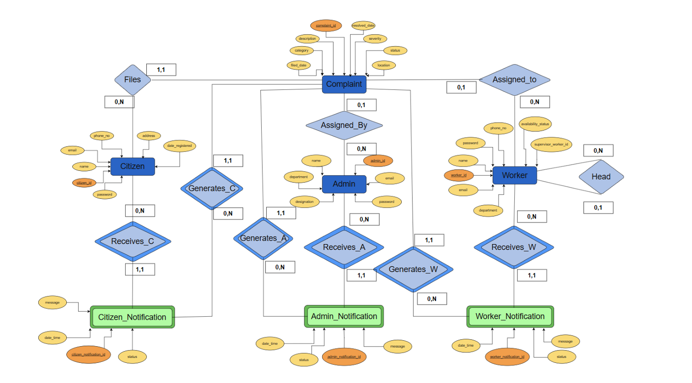

# Municipal Complaint & Citizen Tracking System (MCCTS)

## 📌 Project Overview

The Municipal Complaint & Citizen Tracking System (MCCTS) is a role-based web application designed to streamline the process of registering, assigning, tracking, and resolving municipal complaints.

The system allows citizens to register complaints related to civic issues, admins to manage and assign complaints to workers, and workers to resolve assigned complaints. A built-in notification system ensures transparency and real-time updates for all roles.

This project is built using PHP, MySQL, HTML, and CSS, following secure session-based authentication and clean UI principles.

---

## 👥 User Roles

### 1️⃣ Citizen
- Register complaints
- View complaint status (Pending / In Progress / Resolved / Rejected)
- Receive notifications on complaint updates
- Update profile details
- View complaint history

### 2️⃣ Admin
- View all complaints
- Assign or reassign complaints to workers
- Set complaint severity
- Track assigned complaints
- Receive notifications for assignments and reassignments
- Manage admin profile

### 3️⃣ Worker
- View assigned complaints
- Receive notifications when complaints are assigned or removed
- Work on and resolve complaints

---
## 🗂️ ER Diagram

The following Entity Relationship (ER) diagram represents the overall database structure of the Municipal Complaint & Citizen Tracking System.  
It shows the relationships between **citizen**, **admin**, **worker**, **complaint**, and **notification** entities.


---

## 🔔 Notification System

Notifications are stored in the database and marked as unread/read.  
Badges show unread notification count for each role.

---

## 🛠️ Technologies Used

- Backend: PHP (mysqli with prepared statements)
- Frontend: HTML5, CSS3
- Database: MySQL
- Authentication: Session-based
- Notifications: Database-driven (Unread / Read)

---


## ▶️ How to Run the Project 

## 📘 Step 0: How the Project Works

    This is a PHP–MySQL web application that runs on a local server using Apache and MySQL.  
    We will use XAMPP to set up the environment.

---

## 🧩 Step 1: Download and Install XAMPP

    XAMPP includes Apache, MySQL, and PHP.

    Download from the official site:
    https://www.apachefriends.org/index.html

    Install XAMPP with default settings and ensure Apache and MySQL are selected.

---

## ▶️ Step 2: Start Apache and MySQL

    1. Open XAMPP Control Panel  
    2. Click Start for Apache and MySQL  
    3. Confirm both services are running  

---

## 🗄️ Step 3: Database Setup

### Create Database
    1. Open: http://localhost/phpmyadmin
    2. Click New  
    3. Create database: complaint_system

### Import Database
    1. Select complaint_system  
    2. Click Import  
    3. Choose complaint_system.sql  
    4. Click Go  

All tables and relations will be created automatically.

---

## 📥 Step 4: Clone GitHub Repository

    Navigate to XAMPP htdocs folder:

    Windows:
    C:\xampp\htdocs\

    Linux/macOS:
    /opt/lampp/htdocs/

Clone the repository:
```bash
    git clone https://github.com/ViVan2706/Municipal_Complaint_System.git MCCTS
```
Your structure should look like:

    htdocs/
    └── MCCTS/
        ├── admin/
        ├── citizen/
        ├── worker/
        ├── LoginAndSignup/
        ├── db.php
        ├── complaint_system.sql

---

## ⚙️ Step 5: Configure Database Connection

Open db.php and set:
```bash
    $conn = new mysqli("localhost", "root", "", "complaint_system");
```
---

## 🌐 Step 6: Run the Project

Open browser and visit:
```bash
    http://localhost/MCCTS/LoginAndSignup/login.html
```
---

## ✅ Setup Complete

The Municipal Complaint & Citizen Tracking System is now running locally.


## 🙌 Credits

- [ViVan2706](https://github.com/ViVan2706)
- [nikhiljain10905](https://github.com/nikhiljain10905)
- [yashica-kuki](https://github.com/yashica-kuki)
- [trupesha](https://github.com/trupesha)
- [bstar042005](https://github.com/bstar042005)
